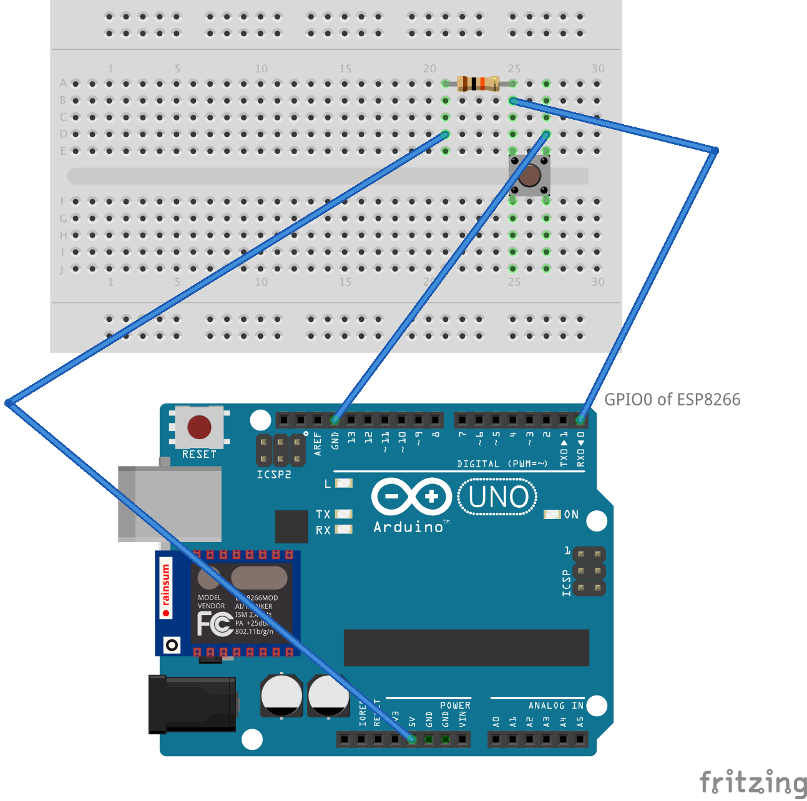
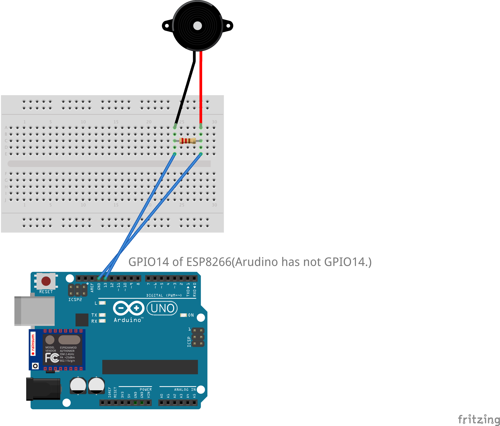

# RemoteBuzzer_Wi-Fi
Remote buzzer with wi-fi connected 2 arduinos (ESP8266).  
They are executable on only ESP8266.  

#How to connect
##Button
  
##Buzzer
 

#How to use
Please fix  
    const char* ssid     = "YOUR_WiFi_SSID";
    const char* password = "YOUR_WiFi_PASSWORD";
